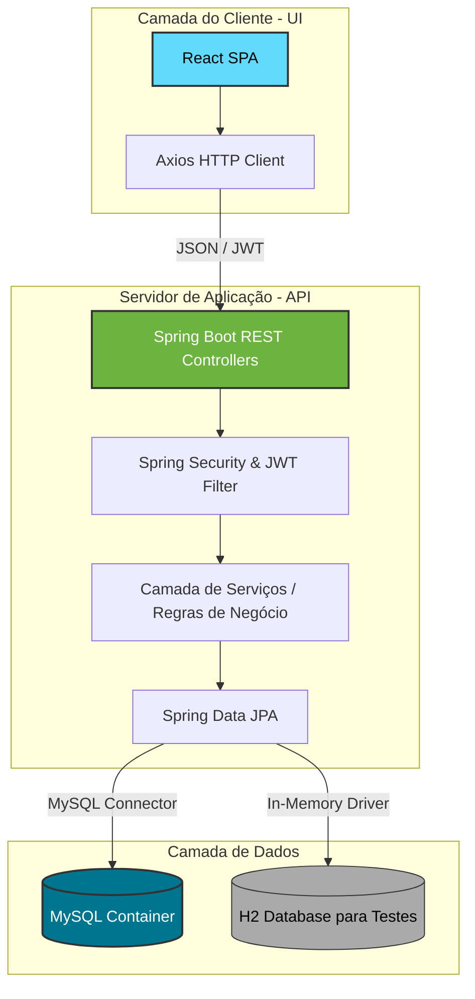

# 🐴 Equoterapia - Sistema de Gestão Clínica e Atividades

[](https://adoptium.net/)
[](https://spring.io/projects/spring-boot)
[](https://react.dev/)
[](https://getbootstrap.com/)
[](https://www.docker.com/)
[](https://www.mysql.com/)

O **Equoterapia** é um sistema completo de gestão clínica e operacional voltado para centros de reabilitação física e mental que utilizam a equoterapia (terapia assistida por cavalos). Ele integra e simplifica as rotinas de terapeutas, instrutores de equitação e administradores, oferecendo um controle centralizado de praticantes (pacientes), evoluções de sessões, anamneses, saúde dos cavalos e escalas de agendamentos.

---

## 🏗️ Arquitetura do Sistema

O projeto é estruturado como um monorepo dividido em duas camadas principais (**Back-end** e **Front-end**) que se comunicam através de uma API REST protegida por autenticação JWT:



---

## 📂 Estrutura de Diretórios

O repositório está organizado da seguinte forma:

```text
Equoterapia/
├── API/
│   └── Equoterapia/                # Código-fonte do Back-end (Spring Boot, Java 23)
│       ├── src/                    # Controllers, Services, Entities e Repositories
│       ├── docker-compose.yaml     # Configuração do MySQL e API em containers Docker
│       ├── pom.xml                 # Dependências e plugins do Maven
│       └── README.md               # Documentação técnica do Back-end
├── UI/                             # Código-fonte do Front-end (React, Bootstrap 5)
│   ├── public/                     # Arquivos estáticos (HTML, favicon, manifest)
│   ├── src/                        # Componentes React (organizados por perfis de acesso)
│   ├── package.json                # Dependências e scripts npm (inclui proxy para a API)
│   └── README.md                   # Instruções de execução do Front-end
├── documentação/                   # Documentos auxiliares e especificações técnicas
│   ├── API.txt                     # Detalhes e arquitetura da API
│   ├── UI.txt                      # Estrutura de componentes e dependências do Front-end
│   └── idea.txt                    # Configuração de IDE (IntelliJ IDEA)
└── README.md                       # Esta documentação principal do projeto
```

---

## 👥 Perfis de Acesso e Funcionalidades

O sistema foi desenhado com base em perfis de acesso bem delimitados para garantir a segurança e a produtividade no centro terapêutico:

### 👑 Administrador
- **Gestão de Equipes**: Cadastro e manutenção de profissionais de saúde e equitadores.
- **Funcionários**: Listagem e arquivamento de funcionários ativos/inativos.
- **Painel Administrativo**: Visão global da agenda e relatórios.

### 🩺 Equoterapeuta (Profissional de Saúde)
- **Cadastro de Praticantes**: Ficha cadastral detalhada de pacientes em múltiplas etapas.
- **Anamnese**: Registro de histórico clínico, limitações motoras e cognitivas.
- **Evolução de Sessões**: Criação de sessões, preenchimento de feedbacks e finalização do atendimento com observações de evolução terapêutica.
- **Responsáveis Legais**: Gerenciamento de tutores para praticantes menores de idade ou com necessidades específicas.

### 🐴 Equitador (Responsável pelos Cavalos)
- **Gestão de Equinos**: Cadastro completo, histórico clínico, comportamento e status de prontidão física de cada cavalo.
- **Agenda dos Cavalos**: Controle de escala dos cavalos para evitar sobrecarga de trabalho físico dos animais.

---

## 🛠️ Stack Tecnológico

### Back-end (API)
- **Linguagem:** Java 23
- **Framework Principal:** Spring Boot 3.4.0
- **Segurança:** Spring Security & JWT (JSON Web Tokens)
- **Persistência de Dados:** Spring Data JPA / Hibernate
- **Documentação da API:** SpringDoc OpenAPI 2.8.3 (Swagger UI)
- **Build & Dependências:** Maven

### Front-end (UI)
- **Linguagem:** JavaScript (ES6+)
- **Framework Principal:** React 18.3.1
- **Roteamento:** React Router DOM 6.28.0
- **Estilização e Componentes:** Bootstrap 5.3.3 & React Bootstrap 2.10.5
- **Requisições HTTP:** Axios v1.8.4
- **Biblioteca de Formatação:** React Input Mask

### Infraestrutura & Dados
- **Banco de Dados Relacional:** MySQL 8.x
- **Banco de Dados de Teste:** H2 Database (em memória)
- **Containerização:** Docker & Docker Compose

---

## 🚀 Como Executar o Projeto

Certifique-se de possuir o **Docker**, **Maven** e **Node.js** instalados localmente.

### 1️⃣ Subir o Banco de Dados (MySQL)
Navegue até a pasta da API e inicie o container do MySQL:
```bash
cd API/Equoterapia
docker-compose up -d db
```
*(O banco de dados estará disponível em `localhost:3306` com a base `Equoterapia` pré-configurada).*

### 2️⃣ Compilar e Rodar o Back-end (API)
Compile o projeto e gere o arquivo `.jar`:
```bash
mvn clean package
```
Suba o container da aplicação Java:
```bash
docker-compose up -d app
```
ou, se preferir rodar localmente sem Docker (garantindo que o banco de dados já esteja de pé):
```bash
mvn spring-boot:run
```
> 📌 **Documentação do Swagger:** Acesse [http://localhost:8080/swagger-ui/index.html](http://localhost:8080/swagger-ui/index.html) para visualizar e interagir com os endpoints da API.
> 📌 **Postman Workspace:** Use a [Collection do Postman](https://www.postman.com/spaceflight-geologist-17996715/workspace/equoterapia-workspace/collection/37274122-0a958160-024f-45a3-b9fa-e8a5074f3fca) para realizar testes rápidos de rotas.

### 3️⃣ Executar o Front-end (UI)
Em uma nova aba do terminal, navegue até a pasta `UI`:
```bash
cd UI
npm install
npm start
```
> 📌 **Acesso Local:** O frontend abrirá no endereço [http://localhost:3000](http://localhost:3000). Graças à configuração de `proxy` no `package.json`, todas as requisições para a API serão redirecionadas automaticamente para `http://localhost:8080` de forma transparente.

---

## ⏹️ Parando o Ambiente Docker
Para suspender os containers:
```bash
docker-compose stop
```
Para remover completamente os containers e redes:
```bash
docker-compose down
```
